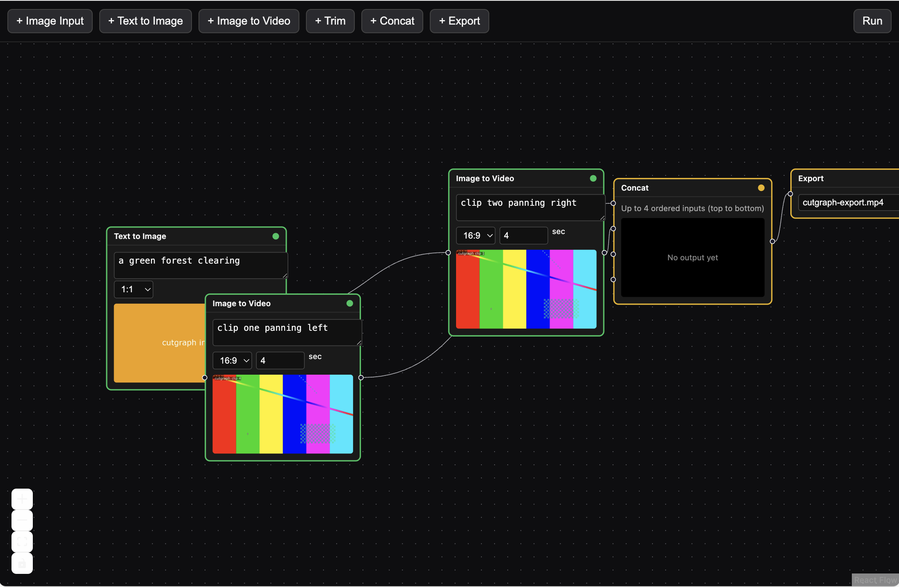

# Cutgraph

[](https://github.com/HagiaSofiya/cutgraph/actions/workflows/ci.yml)

A node-based editor for generative video workflows: a small DAG canvas, in the spirit of
ComfyUI, but for generative clips. Build a graph of image/video generation and editing steps,
run it and watch each node's status stream in live.



Generation nodes run behind one swappable adapter interface. By default the server runs in
*fixture mode*: no real generation API is called, nodes resolve to local canned clips after a
simulated delay with a configurable failure rate. That's what the point of Phase 1 was: prove
the orchestration layer correct (caching, staleness, partial failure, live status streaming,
canvas performance) before a single credit gets spent on a real adapter. See
[Architecture decisions](#architecture-decisions) for why that seam is designed the way it is.

Phase 2 added a second adapter built against the Runway Dev API (`CUTGRAPH_ADAPTER=runway`, see
[Runway adapter](#runway-adapter) below). Fixture mode stays the default.

## Quick start

Requires Node 22.22.2+ (or 24.15+, or 26+) and `ffmpeg` on your `PATH` (used once, offline, to
generate fixture media). That floor is jsdom 30's and only the test suite needs it -- running the
app alone works on Node 20.19+, which is Vite 8's floor, but `npm test` does not.

```bash
npm install
npm run generate-fixtures --workspace=@cutgraph/server
```

Then, in two terminals:

```bash
npm run dev --workspace=@cutgraph/server   # http://localhost:8787
npm run dev --workspace=@cutgraph/web      # http://localhost:5173
```

Open `http://localhost:5173`. On a first visit the canvas is seeded with a sample pipeline —
Text to Image fanning out into two Image to Video branches, concatenated and exported — so
**Run** is the only click needed to watch the whole thing execute. Build your own by adding
nodes from the toolbar and connecting them; **Load sample** puts the demo pipeline back.

## Node types

| Node | Params | Executes | Result |
|---|---|---|---|
| Image Input | none (upload) | client-side (uploads to the server) | persistent |
| Text to Image | `prompt`, `ratio`, `model` | backend job (SSE) | persistent |
| Image to Video | `prompt`, `duration`, `ratio`, `model` | backend job (SSE) | persistent |
| Trim | `start`, `end` | client-side (mediabunny) | ephemeral |
| Concat | up to 4 ordered inputs | client-side (mediabunny) | ephemeral |
| Export | `filename` | client-side (mediabunny, triggers a download) | ephemeral |

"Persistent" results survive a page reload (they're server URLs); "ephemeral" results are
`blob:` URLs that live only in the tab that created them and are re-run after a reload. See
[Architecture decisions](#architecture-decisions) below.

## Architecture

An npm workspaces monorepo, so the reducer and schemas are a single source of truth shared by
both apps:

```
packages/shared/     framework-agnostic core: no React, no server deps
  src/schemas/          Zod schemas for node params, the graph, jobs, SSE events
  src/types/            Graph, GraphNode, GraphEdge, MediaRef
  src/reducer/          the graph state machine (pure), staleness propagation, selectors
  src/cache/            stable hashing + cache-key derivation

apps/server/          Hono backend, orchestrates generation jobs only
  src/jobs/              fixtureAdapter + runwayAdapter (the swappable seam), jobRunner, jobStore,
                         spendGuard
  src/sse/               sseHub, replay-buffered SSE streaming
  src/routes/            jobs, events (SSE), uploads, static fixture/upload serving
  fixtures/              generated media (gitignored; see `npm run generate-fixtures`)

apps/web/             Vite + React + @xyflow/react canvas
  src/state/             graphContext (the reducer wired to React), persistence, reconciliation
  src/orchestrator/      runGraph (the run loop) + one executor per node type
  src/canvas/            xyflow wiring, memoized data-sync bridge
  src/nodes/             one component per node type, shared NodeShell + MediaPreview
  src/media/             mediabunny wrapper (trim/concat/export/poster), blob store

scripts/generate-fixtures.mjs   offline ffmpeg script that seeds apps/server/fixtures/
```

React is a thin layer here on purpose: the reducer, cache-key derivation and run orchestrator
are plain, framework-agnostic TypeScript, independently unit-tested without touching a DOM.

## Architecture decisions

- **Per-node result caching.** `packages/shared/src/cache/cacheKey.ts` derives a node's cache
  key from its type, its own params and its *resolved* upstream output ids, hashed with SHA-256
  (truncated) since `MediaRef.id` *is* the cache key and a collision would serve the wrong
  media. Upstream ordering is canonicalized inside the function itself (sorted by handle, not
  call-site array order), so a graph rebuilt from localStorage in a different insertion order
  still derives byte-identical keys. Editing one node recomputes it and everything downstream;
  unrelated nodes keep their keys and never re-run, and edit-and-revert is an instant cache hit
  since the old key is still in `Graph.resultCache`.
- **Parallel branches.** `apps/web/src/orchestrator/runGraph.ts` gives every node in the run its
  own promise and starts it as soon as its *own* upstreams have settled, rather than walking the
  topological order one node at a time -- so the sample pipeline's two Image to Video legs
  overlap instead of running back to back. Concurrency is capped (default 3, mirroring the
  server's `CUTGRAPH_MAX_CONCURRENT_JOBS`) because past that limit the spend guard answers 429
  and a 429 *fails* a node rather than queuing it; a node waiting for a slot sits in `queued`,
  which is exactly what that state already means. Slots are held only during execution, never
  while waiting on an upstream, which together with an acyclic graph is what keeps the scheduler
  deadlock-free. Two generation nodes that derive the *same* cache key join one in-flight run
  instead of both paying for it -- the free cache hit sequential execution used to give the
  second one. That join is deliberately limited to the two backend-generated types, whose entire
  input is the cache-key preimage: an `ImageInput`'s real input is the file in `blobStore` under
  its own node id, which no cache key describes.
- **Partial failure and staleness.** `packages/shared/src/reducer/graphReducer.ts` is a pure
  reducer over an explicit six-state machine (`idle | queued | running | succeeded | failed |
  stale`). `markStaleIfMeaningful` only invalidates a node that has something to invalidate (a
  retained result or an in-flight run), and a cacheKey-echo guard on every lifecycle action
  makes an edit landing mid-run, a duplicate SSE delivery and reconciliation replay all safe for
  free. A failed node keeps its last-succeeded result and retries independently via
  `retryNode`, which does **not** cascade into that node's stale descendants, so a retry can't
  silently trigger several downstream paid generations.
- **Failure codes, not just messages.** A generation failure carries a `FailureCode`
  (`packages/shared/src/types/index.ts`) from the adapter all the way to the node. The
  distinction that matters is whether retrying the node unchanged can possibly work: a
  `RATE_LIMIT` or `TIMEOUT` says yes, a `MODERATION` or `AUTH` says no, and before this they
  arrived as identical red text under an identical Retry button. The canvas turns the code into a
  hint and relabels the button "Retry anyway" when retrying is not the useful next step.
- **The canvas can tell which adapter is running.** `/api/health` reports the adapter actually
  serving generations, not the one that was configured, plus the models it can run and how much
  of the per-process spend budget is gone. Those differ exactly when `CUTGRAPH_ADAPTER=runway` is
  set without a usable key: the server falls back to fixtures, which used to be visible only as a
  `console.warn` in the server's own terminal, leaving "watching canned clips" and "spending real
  credits" indistinguishable on the canvas. `AdapterBadge.tsx` renders that as a toolbar chip.
- **Stopping a run cancels in-flight jobs.** Run hands `runGraph` an `AbortSignal`; Stop aborts
  it, so no further node starts and every in-flight generation job is cancelled through
  `DELETE /api/jobs/:id`, which calls Runway's own `tasks.delete` -- without it a stopped run
  would keep generating, and billing, to completion. Client-side (mediabunny) nodes cannot
  interrupt an encode already in progress, so for them the signal only prevents work that has not
  started.
- **A job always settles.** `JobRunner` races every `adapter.generate()` against
  `CUTGRAPH_JOB_TIMEOUT_MS`. This is what makes the spend guard's concurrency slot recoverable:
  the slot is released when the adapter settles (or the job is cancelled), and before the timeout
  existed an adapter that hung held its slot for the life of the process.
- **Streaming status.** The backend only orchestrates the two generation node types as jobs;
  `apps/server/src/sse/sseHub.ts` buffers each job's last 3 events and replays them on
  (re)connect, via the `Last-Event-ID` header on the browser's own automatic reconnect or a
  `?lastEventId=` query param for a fresh page load. On boot, `apps/web/src/state/reconciliation.ts`
  finds every node still queued/running, fetches its current status and either applies an
  already-terminal result or resumes the SSE subscription; verified against a real ~25-second
  job that survived a full page reload.
- **Canvas performance.** `MediaPreview.tsx` renders a poster `` by default and mounts a
  real `<video>` only while that node is hovered or selected, so a twelve-node graph never holds
  twelve decoded video elements. `canvas/reconcileFlowNodes.ts` only replaces the `data`
  reference for nodes that actually changed, and every node component is wrapped in
  `React.memo`, so one node's status change doesn't re-render the others.
- **Execution split.** The backend only ever sees the two node types that would eventually call
  a paid API. `ImageInput`, `Trim`, `Concat` and `Export` run entirely in the browser via
  mediabunny, moving through the same reducer with no network round-trip.
- **Server-resolvable media.** A generation job's inputs are always absolute, server-fetchable
  URLs (`apps/server/src/media/uploadStore.ts` content-addresses uploads by SHA-256), never an
  opaque id or a browser-only `blob:` URL. This is what keeps a future real adapter a small diff:
  it needs bytes or a URL, and it already has one.
- **Durability: persistent vs. ephemeral.** Client-side node results (`Trim`, `Concat`,
  `Export` and blob-backed `ImageInput` failures) never leave the tab and can't survive a
  reload; `apps/web/src/state/persistence.ts` strips them before writing to localStorage and
  coerces the node to `stale`. Generation results and uploads are real server URLs and persist
  as-is. This is a real, visible behavior difference between node types, not a bug: it falls
  directly out of "no database, no file storage beyond fixtures and uploads."
- **Concat**, mediabunny's own docs point out, has no single "concatenate N clips" call: the
  high-level `Conversion` API always creates its own track per input, which merges *simultaneous*
  tracks (e.g. video from one file + audio from another), not sequential playback. The
  implementation in `media/mediabunnyClient.ts` instead creates one `VideoSampleSource`/output
  track by hand and manually pumps decoded samples from each input in order, rewriting each
  sample's timestamp by a running cumulative offset.

## Configuration

Env vars for `apps/server` (all optional):

| Variable | Default | Meaning |
|---|---|---|
| `CUTGRAPH_ADAPTER` | `fixture` | `fixture` or `runway` |
| `CUTGRAPH_SIM_MIN_LATENCY_MS` / `_MAX_LATENCY_MS` | 400 / 1200 | simulated queue latency before a job starts running (fixture only) |
| `CUTGRAPH_SIM_MIN_PROCESSING_MS` / `_MAX_PROCESSING_MS` | 1500 / 4000 | simulated generation time (fixture only) |
| `CUTGRAPH_SIM_FAILURE_RATE` | 0.15 | probability a job fails (fixture only) |
| `CUTGRAPH_JOB_RETENTION_MS` | 600000 | how long a finished job stays queryable |
| `CUTGRAPH_JOB_TIMEOUT_MS` | 600000 | wall-clock cap on one generation before it fails as `TIMEOUT` |
| `PORT` | 8787 | server port |
| `CUTGRAPH_PUBLIC_ORIGIN` | `http://localhost:<PORT>` | base URL used to build fixture/upload/output links |
| `CUTGRAPH_RUNWAY_API_KEY` | none | Runway Dev API key, server-side only, never sent to the browser |
| `CUTGRAPH_MAX_GENERATIONS_TOTAL` | 50 | per-process cap on total generations (runway only) |
| `CUTGRAPH_MAX_CONCURRENT_JOBS` | 3 | per-process cap on in-flight generations (runway only) |

And one for `apps/web`:

| Variable | Default | Meaning |
|---|---|---|
| `VITE_API_BASE_URL` | `http://localhost:8787` | where the canvas looks for the API |

`VITE_API_BASE_URL` is read at *build* time (`apps/web/src/api/client.ts`), not at runtime, so it
has to be set before `vite build` -- Vite bakes it into the bundle. A production build made
without it silently ships pointing at localhost.

## Runway adapter

`CUTGRAPH_ADAPTER=runway` swaps the fixture adapter for one built against the Runway Dev API
(`@runwayml/sdk`), implementing the same `GenerationAdapter` interface. A missing or empty
`CUTGRAPH_RUNWAY_API_KEY` logs a loud warning and falls back to fixture mode rather than
crashing the server.

**Getting a key.** Keys come from [dev.runwayml.com](https://dev.runwayml.com/), a portal separate
from the consumer Runway app with its own credit pool -- a Standard/Pro/Max subscription does not
apply. Create an account, create an organization, generate a key under the API Keys tab (shown
once), then fund the organization: there is a $10 minimum at $0.01/credit before the first call.

Note that cutgraph reads `CUTGRAPH_RUNWAY_API_KEY`, not the `RUNWAYML_API_SECRET` that Runway's
SDKs pick up on their own -- `apps/server/src/index.ts` passes the key explicitly. Setting only
the SDK's variable leaves you in fixture mode; the toolbar's adapter chip is what tells you that
happened.

- **Models.** Selectable per node: Text to Image runs `gen4_image` or `grok_imagine_image_2`,
  Image to Video runs `gen4.5` or `gen4_turbo`. Two each rather than Runway's full catalog because
  every model is a distinct SDK param variant with its own ratio literals and duration rules, and
  an unverified mapping is a 400 at generation time rather than a compile error. `gen4_image_turbo`
  looks like the obvious `gen4_image` sibling and is deliberately excluded: it *requires* reference
  images, which this node type does not have. The model is part of the node's params, so switching
  it invalidates that node's cache key and everything downstream for free.
- **Ratio mapping.** Our four ratios (`1:1`, `16:9`, `9:16`, `4:3`) map to explicit pixel-pair
  strings per model, verified against the SDK's own literal types rather than assumed
  (`apps/server/src/jobs/runwayParams.ts`). Both text-to-image models match all four exactly.
  `gen4.5` and `gen4_turbo` accept an identical six-value ratio set, in which `4:3` has no exact
  pixel pair and uses the nearest available (`1104:832`, ~0.5% off true 4:3) as a documented
  approximation.
- **Duration.** gen4.5 accepts an integer from 2 to 10, matching our schema's existing range;
  fractional input is rounded to the nearest integer, not truncated. `gen4_turbo` is typed by the
  SDK as taking a bare `number`, so nothing would catch an out-of-range value at compile time --
  its duration is snapped to the two lengths that model documents (5 or 10), the same way the 4:3
  ratio above prefers a documented near-miss over a silent guess.
- **Input reachability.** Runway fetches input images server-side, so a `http://localhost/...`
  upload URL is unreachable to it. A URL under our own uploads is read straight off disk and
  sent as a base64 data URI instead (capped at Runway's ~3.5MB raw limit, refused with a clear
  error above that rather than silently truncated); any other URL passes through unchanged.
- **Output persistence.** Runway's own output URLs expire in 24-48h. The adapter downloads and
  stores the bytes through the same content-addressed upload store uploads already use, so
  `JobResult.url` stays a stable, persistent URL rather than a link that rots after a couple of
  days.
- **Failure taxonomy.** Content moderation rejections, task failures, rate limits, timeouts and
  auth/billing errors are mapped to distinct, actionable messages
  (`apps/server/src/jobs/runwayErrors.ts`).
- **Cancellation.** `DELETE /api/jobs/:id` calls the SDK's `tasks.delete`, which cancels a task
  that is still running, pending or throttled. The adapter records each accepted task id against
  its job id so there is something to cancel; a job cancelled before Runway accepted it has no
  remote work to stop and is simply marked `CANCELED`.
- **Spend guard.** `POST /api/jobs` rejects with 429 once either per-process limit is hit,
  before a job is ever queued. Only active when the runway adapter is actually selected; fixture
  mode (and every existing test) is unaffected.

## Testing

```bash
npm test          # 194 tests across all three packages
npm run typecheck
```

Every push and pull request runs `npm run typecheck` and `npm test` on Node 22.22.2 and 24
(`.github/workflows/ci.yml`). The lower version is pinned to the exact floor documented above
rather than to the latest 22.x, so CI proves that claim instead of assuming it. No ffmpeg step:
nothing under test reads the generated fixture media.

No test makes a real Runway API call or spends a credit: the param mapping tables, the error
taxonomy and the spend guard are unit-tested directly, and the adapter itself is tested against
a mocked SDK client. Live verification is therefore manual and deliberately out of the automated
suite -- it costs money, so it cannot run on every push:

```bash
npx tsx scripts/verify-runway.ts                                        # dry run, no key needed
CUTGRAPH_RUNWAY_API_KEY=... npx tsx scripts/verify-runway.ts --confirm
```

That drives the real adapter once per interesting parameter combination -- both text-to-image
models, both image-to-video models, the `4:3` near-miss and `gen4_turbo`'s duration snapping,
plus a free auth-failure probe -- and prints the mapped SDK params next to each outcome, so a 400
can be read against the exact value that caused it. About 125 credits (~$1.25). The dry run needs
no credits and still shows what every mapping resolves to.

WebCodecs can't run in jsdom, so mediabunny itself is mocked in `apps/web` unit tests; the
orchestration logic around it (executors, the run loop, persistence, reconciliation) is what's
under test. The real codec paths (trim, concat, poster extraction, export) have been exercised
manually in a real browser end to end.

## Explicitly out of scope

Auth, a database, multi-user, undo/redo, a settings page, any node type beyond the six above.
Persistence is localStorage only.

Deployment, too: there is no hosted demo and no deploy config. The server runs under `tsx`
against raw TypeScript sources and consumes `@cutgraph/shared` as source rather than a build, so
there is no production build path to deploy -- adding one is real work, not a checkbox.

CORS is wide open by design at this scale: `apps/server/src/index.ts` calls `cors()` with no
`origin`, which defaults to `Access-Control-Allow-Origin: *`. That is fine for two localhost
ports and would need an allowlist before this was ever exposed.
